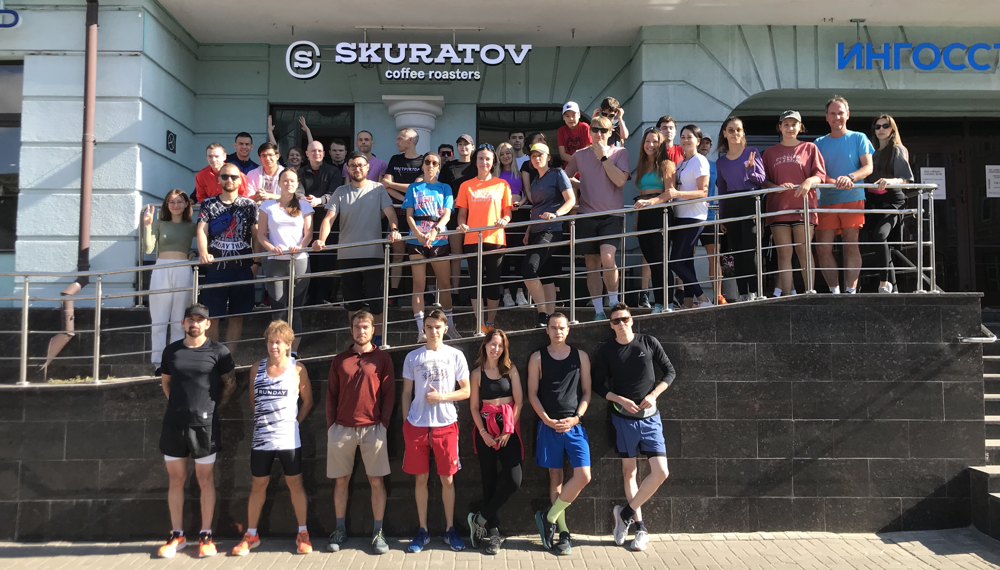

# SkuRunCoffeeBot_v3

Телеграм-бот для бегового клуба кофейни Скуратов в Казани.

Использована библиотека [aiogram](https://docs.aiogram.dev/en/dev-3.x/index.html).

## Команды

+ Подключение виртуальной среды для разработки

      make venv
      source venv/bin/activate

+ Загрузка необходимых для работы бота модулей:

      make install_deps

+ Сохранение зависимостей в файл requirements.txt:

      make freeze_deps

+ Запуск телеграм-бота:

      make run

+ Запуск телеграм-бота на pythonanywhere.com:

      make pythonanywhere_run

+ Сборка бота в tar-архив (Makefile и файл БД не архивируются):

      make pack

+ Распаковка tar-архива с ботом:

      make unpack

+ Очистка проекта от файлов кеширования

      make clean

## Описание

Данные пользователей сохраняются в файле базы данных `sqlite3`. Запросы написаны с помощью модуля `SQLAlchemy` и выполняются асинхронно.

Заказы пользователей отправляются в google sheets с помощью подключения `Google Sheets API`.

## Материалы, использованные в процессе написания кода

### aiogram

+ [Официальная документация aiogram](https://docs.aiogram.dev/en/latest/)

+ [habr.yakvenalex](https://habr.com/ru/users/yakvenalex/)

    + [Telegram Боты на Aiogram 3.x: Первые Шаги](https://habr.com/ru/companies/amvera/articles/820527/)

    + [Telegram Боты на Aiogram 3.x: Текстовая клавиатура и Командное меню](https://habr.com/ru/articles/820733/)

    + [Telegram Боты на Aiogram 3.x: Инлайн кнопки и CallBack Дата](https://habr.com/ru/articles/820877/)

    + [Telegram Боты на Aiogram 3.x: Магия фильтров](https://habr.com/ru/articles/821085/)

    + [asynpg-lite: Простой асинхронный менеджер для PostgreSQL на Python](https://habr.com/ru/articles/821323/)

    + [Telegram Боты на Aiogram 3.x: Message handler и трюки с текстом](https://habr.com/ru/articles/821661/)

    + [Telegram Боты на Aiogram 3.x: Отправка и обработка медиа сообщений](https://habr.com/ru/articles/821961/)

    + [Telegram Боты на Aiogram 3.x: Все про FSM простыми словами](https://habr.com/ru/articles/822061/)

    + [Telegram Боты на Aiogram 3.x:  Интеграция с PostgreSQL в пару строк кода](https://habr.com/ru/articles/822083/)

    + [Telegram Боты на Aiogram 3.x: Профиль, админ-панель и реферальная система](https://habr.com/ru/articles/822809/)

+ [Пишем Telegram-ботов с aiogram 3.x](https://mastergroosha.github.io/aiogram-3-guide/)

    + [aiogram-3-guide](https://github.com/MasterGroosha/aiogram-3-guide)

+ [habr.ivankarmanow](https://habr.com/ru/users/ivankarmanow/)
  
    + [За границей Hello World: полный гайд по разработке Telegram ботов с помощью Python и Aiogram 3. Часть 1](https://habr.com/ru/articles/732136/)

    + [За границей Hello World: полный гайд по разработке Telegram ботов на Python + Aiogram 3. Часть 2: Меню и OpenAI API](https://habr.com/ru/articles/733732/)

+ YouTube-channel `sudo teach`

### Google Sheets API

+ [Документация Google Sheets Guides](https://developers.google.com/sheets/api/guides/concepts)

    + [Read & write cell values](https://developers.google.com/sheets/api/guides/values)

    + [Method: spreadsheets.batchUpdate](https://developers.google.com/sheets/api/reference/rest/v4/spreadsheets/batchUpdate)

+ [Генерируем красивую Google-таблицу из своей программы (используя Google Sheets API v4)](https://habr.com/ru/articles/305378/)

+ [Google Sheets API + Python. Чтение и запись с Сервисным Аккаунтом Google Cloud](https://habr.com/ru/articles/575160/)

+ [Видео: Работаем с Google Sheets API на Python](https://www.youtube.com/watch?v=Bf8KHZtcxnA)

### Для разработки асинхронных запросов в Google Sheets API

+ [Авторизация OAuth 2.0 от Google, небольшое упущение его разработчиков и Python](https://habr.com/ru/articles/713442/)

+ [OAuth 2: введение в протокол авторизации](https://selectel.ru/blog/oauth-2/)

+ [Retrieving Access Token from Service Account using oauth2client and google-auth with Python](https://gist.github.com/tanaikech/5196ed237812192539c4369000bc131b)

+ [Подробно про JWT](https://habr.com/ru/articles/842056/)

+ [ The OAuth 2.0 Authorization Framework...Token Endpoint](https://datatracker.ietf.org/doc/html/rfc6749#section-3.2:~:text=first.%0A%0A3.2.-,Token%20Endpoint,-The%20token%20endpoint)
